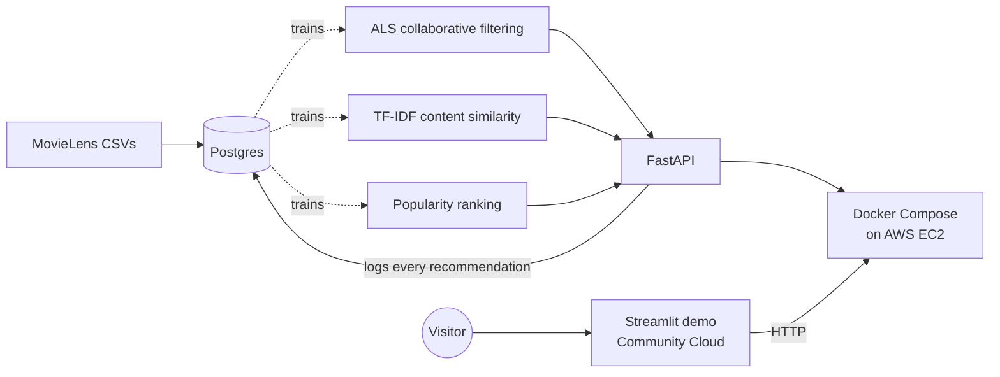

# Hybrid Movie Recommendation System

**A personalized movie recommender, built and shipped end-to-end: trained on real data,
tested with a live A/B experiment, and deployed as a working web service on AWS. Not a
notebook, a real product.**

In plain terms: this system predicts which movies a person will like by combining two
techniques (collaborative filtering plus content-based filtering), then proves, with a
statistically significant experiment, that this personalized approach meaningfully
outperforms just showing everyone a generic "most popular" list.

### Try it

**[CineMatch, the interactive demo](https://himanshumjain15-recsys.streamlit.app)**. Pick a
viewer and see the same person's recommendations from three different models side by side.

The demo calls a live API rather than bundling a copy of the model:

| | |
|---|---|
| Recommendations | `http://3.134.153.110:8000/recommend/{user_id}?model_name=hybrid` |
| Also accepts | `model_name=popularity`, `model_name=content` |
| Interactive API docs | `http://3.134.153.110:8000/docs` |
| Health check | `http://3.134.153.110:8000/health` |

The API runs on a single EC2 instance that is occasionally switched off to control costs.
The demo degrades gracefully and says so if it can't reach it.

## Skills demonstrated

Machine learning modeling · Statistical experiment design (A/B testing, power analysis) ·
Database design (PostgreSQL) · REST API development (FastAPI) · Containerization (Docker) ·
Cloud deployment (AWS EC2 plus Streamlit Community Cloud) · Production debugging (six real
deployment issues diagnosed and fixed, documented below)

## Results

**The headline finding**: personalized recommendations beat a generic popularity list by a
wide, statistically proven margin, validated with a real A/B test rather than a notebook
comparison.

| Group | Hit-rate@10 | n | 95% CI |
|---|---|---|---|
| Control (popularity) | 29.35% | 293 | 24.43% to 34.81% |
| Treatment (hybrid) | 42.54% | 315 | 37.20% to 48.06% |

**Lift: 13.19 points (44.9% relative). p = 0.00072.** Statistically and practically
significant, clearing the pre-registered minimum detectable effect (15% relative lift) even
at the conservative end of the confidence interval.

*(Hit-rate@10 = the percentage of users for whom at least one of the top 10 recommended
movies was something they actually went on to rate highly.)*

Offline model comparison (full population, before the live A/B split):

| Model | Hit-rate@10 | Precision@10 | Recall@10 |
|---|---|---|---|
| Popularity Baseline | 31.13% | 5.60% | 5.05% |
| Collaborative Filtering | 42.13% | 6.82% | 7.97% |
| Hybrid (weight=0.1) | 43.65% | 7.01% | 8.56% |

## Architecture



- **Data layer**: Postgres (`users`, `items`, `interactions`, `recommendation_logs`,
  `experiment_assignments`), run via Docker, schema auto-initialized on first start
- **Model**: collaborative filtering (ALS via `implicit`) blended with content-based
  filtering (TF-IDF genre similarity via `scikit-learn`), weight tuned via held-out
  evaluation
- **Serving**: FastAPI, model and similarity matrix loaded once at startup, every served
  recommendation logged to Postgres
- **Experimentation**: users deterministically bucketed into control and treatment groups
  (`hashlib.md5`-based), each group served by a different model, compared via a
  two-proportion significance test
- **Deployment**: containerized (Docker Compose: API plus Postgres), running live on an AWS
  EC2 instance

## Tech stack

Python, pandas, scikit-learn, `implicit` (ALS), FastAPI, PostgreSQL, SQLAlchemy, Docker and
Docker Compose, AWS EC2, `scipy`/`statsmodels` for the A/B significance test.

## Project structure

```
sample_data/inputs/  # raw MovieLens files (gitignored, downloaded on demand)
parser/              # data loading and train/held-out split
scoring/             # popularity, collaborative filtering, content-based, hybrid logic
db/                  # Postgres schema, ingestion, experiment assignment/generation
api/                 # FastAPI app
streamlit_app/       # CineMatch, the public demo
notebooks/           # EDA, modeling, and A/B analysis notebooks
Dockerfile, docker-compose.yml
requirements.txt     # demo dependencies (Streamlit Community Cloud reads this)
requirements-api.txt # API dependencies (used by the Dockerfile)
```

## Setup: local development

```powershell
python -m venv .venv
.venv\Scripts\Activate.ps1
pip install -r requirements.txt

# Download the dataset (not committed, fetched fresh)
Invoke-WebRequest -Uri "https://files.grouplens.org/datasets/movielens/ml-latest-small.zip" -OutFile "sample_data\inputs\ml-latest-small.zip"
Expand-Archive -Path "sample_data\inputs\ml-latest-small.zip" -DestinationPath "sample_data\inputs" -Force
Remove-Item "sample_data\inputs\ml-latest-small.zip"
```

Open `notebooks/` in VS Code, select the `.venv` kernel, and run in order:
`01-explore-data.ipynb` → `02-baseline-models.ipynb` → `03-hybrid-model.ipynb` →
`04-ab-testing.ipynb`.

## Setup: full stack via Docker

```bash
docker compose up --build -d
docker exec -it recsys_api python db/ingest.py   # first run only, populates Postgres
```

API available at `http://localhost:8000`. `/health` for a status check,
`/recommend/{user_id}` for recommendations.

## Deployment

Two pieces, deployed separately.

**The API and database** run on a single AWS EC2 instance (`t3.micro`, Ubuntu) using the
same Docker Compose setup as local development, with no separate deployment config. An
Elastic IP (`3.134.153.110`) keeps the address fixed across instance restarts, so published
links survive the instance being stopped and started.

**The demo** runs on Streamlit Community Cloud, deployed straight from this repository. It
holds no model of its own. It calls the EC2 API over HTTP, so what a visitor sees is the
deployed system's actual output rather than a local copy. Because the raw data isn't
committed, the app downloads the MovieLens archive on first run.

## Challenges and solutions

Real issues surfaced during containerization and deployment, diagnosed and fixed rather
than avoided:

- **Missing runtime dependency**: `implicit`'s compiled ALS code needs `libgomp` (GNU
  OpenMP), absent from the slim base image. Fixed by installing `libgomp1` explicitly.
- **Container networking**: the API initially tried to reach Postgres at `localhost`,
  which inside a container means "itself," not the neighboring database container. Fixed
  by using the Postgres service's Docker Compose service name as the hostname.
- **Out-of-memory crash on a `t3.micro`**: the ~700MB content similarity matrix exceeded
  available RAM on a 1GB instance. Fixed by adding swap space, a standard technique for
  memory-constrained cloud instances.
- **Silent partial outage after an instance restart**: the API container lacked a restart
  policy (unlike Postgres), so it didn't come back after a host reboot. Fixed by adding
  `restart: unless-stopped` to both services.
- **Disk space exhaustion from repeated builds**: a small 8GB EC2 volume filled up after a
  couple of rebuilds, blocking further deployments. Cleaned up with `docker system prune`
  as an immediate fix, then resolved permanently by resizing the EBS volume to 20GB and
  extending the filesystem (`growpart` plus `resize2fs`).
- **A caching failure that outlived its cause**: the demo first deployed with an invalid
  TMDB key, so every poster lookup returned nothing, and `@st.cache_data` stored those
  empty results. Correcting the key changed nothing, because the cached failures were
  served instead of re-running the lookup. Rebooting the app cleared it. Caching a failure
  is different from caching a result.

## Known limitations

- **This is an offline A/B test, not a live one**: it evaluates against historical
  held-out data rather than real-time reactions to what was actually shown to users. That
  is a known limitation of offline recommender evaluation, not a true randomized live
  experiment.
- **Small dataset**: MovieLens `ml-latest-small` (610 users, ~100K ratings), enough to
  demonstrate the full pipeline and produce a statistically significant result, but small
  relative to production-scale recommender systems.
