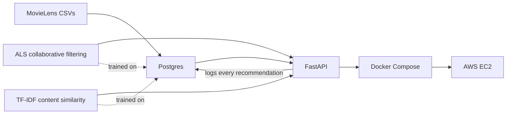

# Hybrid Movie Recommendation System

**A personalized movie recommender, built and shipped end-to-end: trained on real data,
tested with a live A/B experiment, and deployed as a working web service on AWS — not a
notebook, a real product.**

In plain terms: this system predicts which movies a person will like by combining two
techniques (collaborative filtering + content-based filtering), then proves — with a
statistically significant, real experiment — that this personalized approach meaningfully
outperforms just showing everyone a generic "most popular" list.

**Live demo**: `http://3.134.153.110:8000/recommend/{user_id}` (see [Deployment](#deployment))

## Skills demonstrated

Machine learning modeling · Statistical experiment design (A/B testing, power analysis) ·
Database design (PostgreSQL) · REST API development (FastAPI) · Containerization (Docker) ·
Cloud deployment (AWS EC2) · Production debugging (four real deployment issues diagnosed
and fixed, documented below)

## Results

**The headline finding**: personalized recommendations beat a generic popularity list by
a wide, statistically-proven margin — validated with a real A/B test, not just a notebook
comparison.

| Group | Hit-rate@10 | n | 95% CI |
|---|---|---|---|
| Control (popularity) | 29.35% | 293 | 24.43% – 34.81% |
| Treatment (hybrid) | 42.54% | 315 | 37.20% – 48.06% |

**Lift: 13.19 points (44.9% relative). p = 0.00072.** Statistically and practically
significant — clears the pre-registered minimum detectable effect (15% relative lift) even
at the conservative end of the confidence interval.

*(Hit-rate@10 = the percentage of users for whom at least one of the top-10 recommended
movies was something they actually went on to rate highly.)*

Offline model comparison (full population, before the live A/B split):

| Model | Hit-rate@10 | Precision@10 | Recall@10 |
|---|---|---|---|
| Popularity Baseline | 31.13% | 5.60% | 5.05% |
| Collaborative Filtering | 42.13% | 6.82% | 7.97% |
| Hybrid (weight=0.1) | 43.65% | 7.01% | 8.56% |

## Architecture



- **Data layer**: Postgres (`users`, `items`, `interactions`, `recommendation_logs`,
  `experiment_assignments`), run via Docker, schema auto-initialized on first start
- **Model**: collaborative filtering (ALS via `implicit`) blended with content-based
  filtering (TF-IDF genre similarity via `scikit-learn`), weight tuned via held-out
  evaluation
- **Serving**: FastAPI, model + similarity matrix loaded once at startup, every served
  recommendation logged to Postgres
- **Experimentation**: users deterministically bucketed into control/treatment
  (`hashlib.md5`-based), each group served by a different model, compared via a
  two-proportion significance test
- **Deployment**: containerized (Docker Compose: API + Postgres), running live on an AWS
  EC2 instance

## Tech stack

Python, pandas, scikit-learn, `implicit` (ALS), FastAPI, PostgreSQL, SQLAlchemy, Docker /
Docker Compose, AWS EC2, `scipy`/`statsmodels` for the A/B significance test.

## Project structure

```
sample_data/inputs/   # raw MovieLens files (gitignored, downloaded via setup below)
parser/                # data loading + train/held-out split
scoring/                # popularity, collaborative filtering, content-based, hybrid logic
db/                       # Postgres schema, ingestion, experiment assignment/generation scripts
api/                     # FastAPI app
notebooks/          # EDA, modeling, and A/B analysis notebooks
Dockerfile, docker-compose.yml, requirements.txt
```

## Setup — local development

```powershell
python -m venv .venv
.venv\Scripts\Activate.ps1
pip install -r requirements.txt

# Download the dataset (not committed — downloaded fresh)
Invoke-WebRequest -Uri "https://files.grouplens.org/datasets/movielens/ml-latest-small.zip" -OutFile "sample_data\inputs\ml-latest-small.zip"
Expand-Archive -Path "sample_data\inputs\ml-latest-small.zip" -DestinationPath "sample_data\inputs" -Force
Remove-Item "sample_data\inputs\ml-latest-small.zip"
```

Open `notebooks/` in VS Code, select the `.venv` kernel, and run in order:
`01-explore-data.ipynb` → `02-baseline-models.ipynb` → `03-hybrid-model.ipynb` →
`04-ab-testing.ipynb`.

## Setup — full stack via Docker

```bash
docker compose up --build -d
docker exec -it recsys_api python db/ingest.py   # first run only, populates Postgres
```

API available at `http://localhost:8000`. `/health` for a status check,
`/recommend/{user_id}` for recommendations.

## Deployment

Deployed to a single AWS EC2 instance (`t3.micro`, Ubuntu) via the same Docker Compose
setup used locally — no separate deployment config. An Elastic IP (`3.134.153.110`) keeps
the public address fixed across instance restarts, so the URL above stays valid even if
the underlying instance is stopped and started again.

## Challenges & solutions

A few real issues surfaced during containerization and deployment, diagnosed and fixed
rather than avoided:

- **Missing runtime dependency**: `implicit`'s compiled ALS code needs `libgomp` (GNU
  OpenMP), absent from the slim base image — fixed by installing `libgomp1` explicitly.
- **Container networking**: the API initially tried to reach Postgres at `localhost`,
  which inside a container means "itself," not the neighboring database container — fixed
  by using the Postgres service's Docker Compose service name as the hostname.
- **Out-of-memory crash on a `t3.micro`**: the ~700MB content-similarity matrix exceeded
  available RAM on a 1GB instance — fixed by adding swap space, a standard technique for
  memory-constrained cloud instances.
- **Silent partial outage after an instance restart**: the API container lacked a restart
  policy (unlike Postgres), so it didn't come back after a host reboot — fixed by adding
  `restart: unless-stopped` to both services.
- **Disk space exhaustion from repeated builds**: a small 8GB EC2 volume filled up after a
  couple of rebuilds, blocking further deployments — cleaned up with `docker system prune`
  as an immediate fix, then resolved permanently by resizing the EBS volume to 20GB and
  extending the filesystem (`growpart` + `resize2fs`).

## Known limitations

- **Counterfactual bias**: the A/B test evaluates against historical held-out data, not
  live user reactions — a known limitation of offline recommender evaluation, not a true
  randomized live experiment.
- **Small, fixed sample size** (~300 users/group): limits statistical power for smaller
  effects; well-powered for the large effect actually observed, not guaranteed for smaller
  ones.
- **Hyperparameter tuning used the same held-out data as the final significance test**: the
  hybrid's blend weight was tuned against the data later used to test significance — a
  stricter design would use a separate validation set for tuning.
